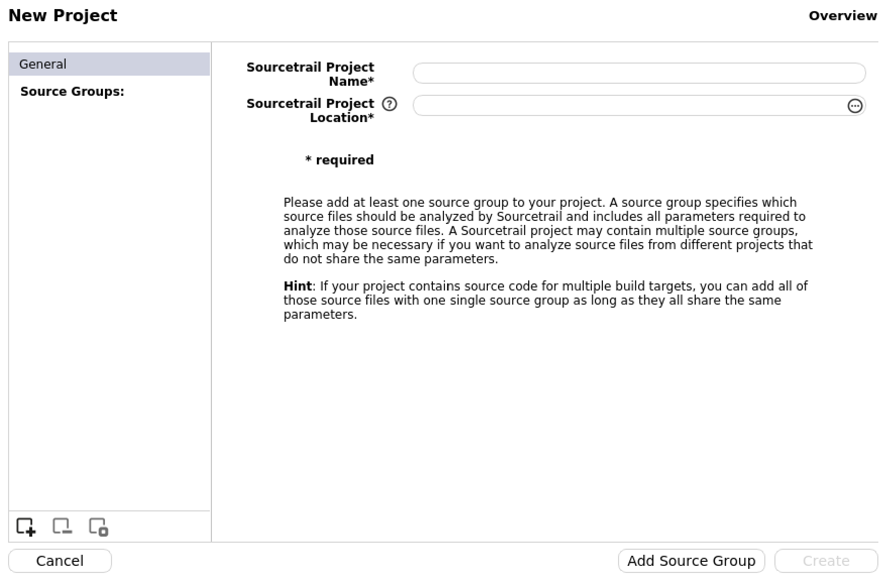
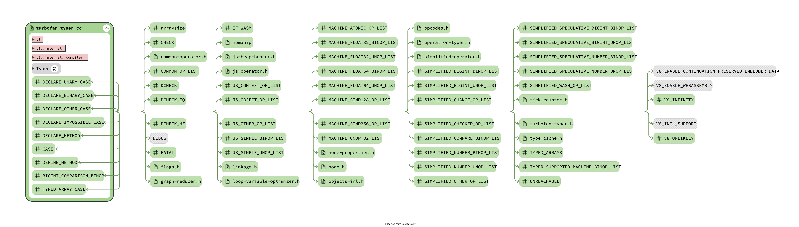

# 1주차 과제 산출물

---

| 작성자 | 최부근 |
| --- | --- |

## **분석 대상**

---

[chromium-review.googlesource.com](https://chromium-review.googlesource.com/c/v8/v8/+/6298237)

## **V8 빌드**

---

1. **V8 다운로드**

```jsx
git clone https://chromium.googlesource.com/v8/v8
git fetch origin
```

1. **취약점 발생 커밋 체크아웃**

```jsx
git checkout e9c28abfe4d8f4c86c15d0280645bc95cbae9779^
git log --grep="Cr-Commit-Position: refs/heads/main@{#98911}" -n 1

cd v8
gclient sync
```

1. **depot 설치**

```jsx
git clone https://chromium.googlesource.com/chromium/tools/depot_tools.git
export PATH="$PWD/depot_tools:$PATH"
```

1. **SourceCode database(JSON) 익스포트용 gn 빌드**

```jsx
gn gen out.gn/x64.release --export-compile-commands --args='is_debug=false v8_monolithic=true v8_use_external_startup_data=false is_component_build = false is_clang=true clang_use_chrome_plugins = false'
```

옵션 설명: 

| **export-compile-commands**  | **컴파일 데이터베이스 익스포트** (컴파일시 사용되는 옵션 기록) |
| --- | --- |
| **is_debug** | **디버그 심볼 포함 여부** (true면 심볼 포함, false면 심볼 미포함) |
| **v8_monolithic**  | **라이브러리 패키징 여부 (true면 하나의 라이브러리, false면 여러 라이브러리)** |
| **v8_use_external_startup_data** |  |
| **is_component_build** |  |
| **is_clang** | **Clang 컴파일러를 사용할지 여부** |
| **clang_use_chrome_plugins** | **크롬에서 제공되는 Clang 플러그인 사용 여부**  |

1. **익스포트된 db 간소화**

<aside>

[
{
"file": "../../src/compiler/turbofan-typer.cc",
"directory": "/home/bugeun/v8/v8/out.gn/x64.release",
"command": " ../../third_party/llvm-build/Release+Asserts/bin/clang++ -MMD -MF  obj/v8_compiler/turbofan-typer.o.d  -DUSE_UDEV -DUSE_AURA=1 -DUSE_GLIB=1 -DUSE_OZONE=1 -D__STDC_CONSTANT_MACROS -D__STDC_FORMAT_MACROS -D_FORTIFY_SOURCE=2 -D_FILE_OFFSET_BITS=64 -D_LARGEFILE_SOURCE -D_LARGEFILE64_SOURCE -D_GNU_SOURCE \"-DCR_CLANG_REVISION=\\\"llvmorg-21-init-1655-g7b473dfe-1\\\"\" -D_LIBCPP_HARDENING_MODE=*LIBCPP_HARDENING_MODE_EXTENSIVE -D_LIBCPP_DISABLE_VISIBILITY_ANNOTATIONS -D_LIBCXXABI_DISABLE_VISIBILITY_ANNOTATIONS -D_LIBCPP_INSTRUMENTED_WITH_ASAN=0 -DCR_LIBCXX_REVISION=cdc82e180c610aaa7153301fea4d6b4005da9f22 -DTMP_REBUILD_HACK -DCR_SYSROOT_KEY=20250129T203412Z-1 -DNDEBUG -DNVALGRIND -DDYNAMIC_ANNOTATIONS_ENABLED=0 -DV8_TYPED_ARRAY_MAX_SIZE_IN_HEAP=64 -DENABLE_GDB_JIT_INTERFACE -DV8_INTL_SUPPORT -DV8_ATOMIC_OBJECT_FIELD_WRITES -DV8_ENABLE_LAZY_SOURCE_POSITIONS -DV8_WIN64_UNWINDING_INFO -DV8_ENABLE_REGEXP_INTERPRETER_THREADED_DISPATCH -DV8_ENABLE_FUZZTEST -DV8_SHORT_BUILTIN_CALLS -DV8_EXTERNAL_CODE_SPACE -DV8_ENABLE_SPARKPLUG -DV8_ENABLE_MAGLEV -DV8_ENABLE_TURBOFAN -DV8_ENABLE_WEBASSEMBLY -DV8_ENABLE_CONTINUATION_PRESERVED_EMBEDDER_DATA -DV8_ALLOCATION_FOLDING -DV8_ALLOCATION_SITE_TRACKING -DV8_ADVANCED_BIGINT_ALGORITHMS -DV8_STATIC_ROOTS -DV8_USE_ZLIB -DV8_USE_LIBM_TRIG_FUNCTIONS -DV8_ENABLE_WASM_SIMD256_REVEC -DV8_ENABLE_MAGLEV_GRAPH_PRINTER -DV8_ENABLE_BUILTIN_JUMP_TABLE_SWITCH -DV8_ENABLE_EXTENSIBLE_RO_SNAPSHOT -DV8_ENABLE_BLACK_ALLOCATED_PAGES -DV8_ENABLE_LEAPTIERING -DV8_WASM_RANDOM_FUZZERS -DV8_ARRAY_BUFFER_INTERNAL_FIELD_COUNT=0 -DV8_ARRAY_BUFFER_VIEW_INTERNAL_FIELD_COUNT=0 -DV8_PROMISE_INTERNAL_FIELD_COUNT=0 -DV8_COMPRESS_POINTERS -DV8_COMPRESS_POINTERS_IN_SHARED_CAGE -DV8_31BIT_SMIS_ON_64BIT_ARCH -DV8_ENABLE_SANDBOX -DV8_DEPRECATION_WARNINGS -DV8_IMMINENT_DEPRECATION_WARNINGS -DV8_HAVE_TARGET_OS -DV8_TARGET_OS_LINUX -DCPPGC_CAGED_HEAP -DCPPGC_YOUNG_GENERATION -DCPPGC_POINTER_COMPRESSION -DCPPGC_ENABLE_LARGER_CAGE -DCPPGC_SLIM_WRITE_BARRIER -DV8_TARGET_ARCH_X64 -DV8_RUNTIME_CALL_STATS -DABSL_ALLOCATOR_NOTHROW=1 -DU_USING_ICU_NAMESPACE=0 -DU_ENABLE_DYLOAD=0 -DUSE_CHROMIUM_ICU=1 -DU_ENABLE_TRACING=1 -DU_ENABLE_RESOURCE_TRACING=0 -DU_STATIC_IMPLEMENTATION -DICU_UTIL_DATA_IMPL=ICU_UTIL_DATA_FILE  -I../.. -Igen -I../../buildtools/third_party/libc++ -I../../include -I../../third_party/abseil-cpp -Igen/include -I../../third_party/icu/source/common -I../../third_party/icu/source/i18n -I../../third_party/fp16/src/include  -Wall -Wextra -Wimplicit-fallthrough -Wextra-semi -Wunreachable-code-aggressive -Wthread-safety -Wgnu -Wno-gnu-anonymous-struct -Wno-gnu-conditional-omitted-operand -Wno-gnu-include-next -Wno-gnu-label-as-value -Wno-gnu-redeclared-enum -Wno-gnu-statement-expression -Wno-gnu-zero-variadic-macro-arguments -Wno-zero-length-array -Wno-missing-field-initializers -Wno-unused-parameter -Wno-psabi -Wloop-analysis -Wno-unneeded-internal-declaration -Wno-cast-function-type -Wno-thread-safety-reference-return -Wno-nontrivial-memcall -Wshadow -Werror -fno-delete-null-pointer-checks -fno-strict-overflow -fno-ident -fno-strict-aliasing -fstack-protector -funwind-tables -fPIC -pthread -fcolor-diagnostics -fmerge-all-constants -fno-sized-deallocation -fcrash-diagnostics-dir=../../tools/clang/crashreports -mllvm -instcombine-lower-dbg-declare=0 -mllvm -split-threshold-for-reg-with-hint=0 -ffp-contract=off -Wa,--crel,--allow-experimental-crel -fcomplete-member-pointers -m64 -msse3 -Wno-builtin-macro-redefined -D__DATE*_= -D__TIME__= -D__TIMESTAMP__= -ffile-compilation-dir=. -no-canonical-prefixes -fno-omit-frame-pointer -g0 -Wheader-hygiene -Wstring-conversion -Wtautological-overlap-compare -Wunreachable-code -Wctad-maybe-unsupported -Wno-invalid-offsetof -Wshorten-64-to-32 -Wmissing-field-initializers -O3 -fdata-sections -ffunction-sections -fno-unique-section-names -fno-math-errno -fvisibility=default -Wexit-time-destructors  -Wno-invalid-offsetof -Wenum-compare-conditional -Wno-c++11-narrowing-const-reference -Wno-missing-template-arg-list-after-template-kw -std=c++20 -Wno-trigraphs -gsimple-template-names -fno-exceptions -fno-rtti -nostdinc++ -isystem../../third_party/libc++/src/include -isystem../../third_party/libc++abi/src/include --sysroot=../../build/linux/debian_bullseye_amd64-sysroot  -c ../../src/compiler/turbofan-typer.cc -o  obj/v8_compiler/turbofan-typer.o"
}
]

</aside>

## **Sourcetrail 사용법**

---

1. **Sourcetrail 설치 및 실행**

```jsx
wget https://github.com/CoatiSoftware/Sourcetrail/releases/download/2021.4.19/Sourcetrail_2021_4_19_Linux_64bit.AppImage
./Sourcetrail_2021_4_19_Linux_64bit.AppImage
```

1. **프로젝트 이름과 V8 소스코드 경로 추가** 



1. **C/C++ 소스코드 데이터베이스 선택**


1. **Compilation Database에 익스포트한 소스코드 데이터베이스를 입력하고 Excluded Files에는 아래 폴더를 추가**

```jsx
third-party
test
testing
```


1. **Create 선택 후 Indexing 했을 때 보이는 최종 결과**



## Doxygen 사용법

---

1. **Doxygen 설치**

```jsx
https://www.doxygen.nl/download.html
```

1. **Doxywizard 실행 후 실행 경로 지정**


1. **프로젝트 정보와 소스 코드 경로 설정**


1. **소스코드 언어 설정**


1. **출력 결과(포맷, 확장자 등) 설정**


1. **소스 브라우저 설정 (INLINE_SOURCES 설정 시 각 멤버 함수마다 소스를 보여준다.)**


1. **CHM 설정 (CHM은 마이크로 소프트의 도움말 포맷으로 개인적으로 보기 더 편리하였음)**


                HHC_LOCATION 기본 경로는 (C:\Program Files (x86)\HTML Help Workshop)

1. **GraphViz 설정 (GraphViz 설치 방법은 생략)**


                                                             Use dot toll from the GraphViz package 선택


                                                           DOT_PATH에 GraphViz 바이너리 경로 설정

1. **문서화 실행 (Expert → Project → Language 설정에서 한국어 설정 가능)**


1. **최종 결과 파일(HTML.zip 참조)**